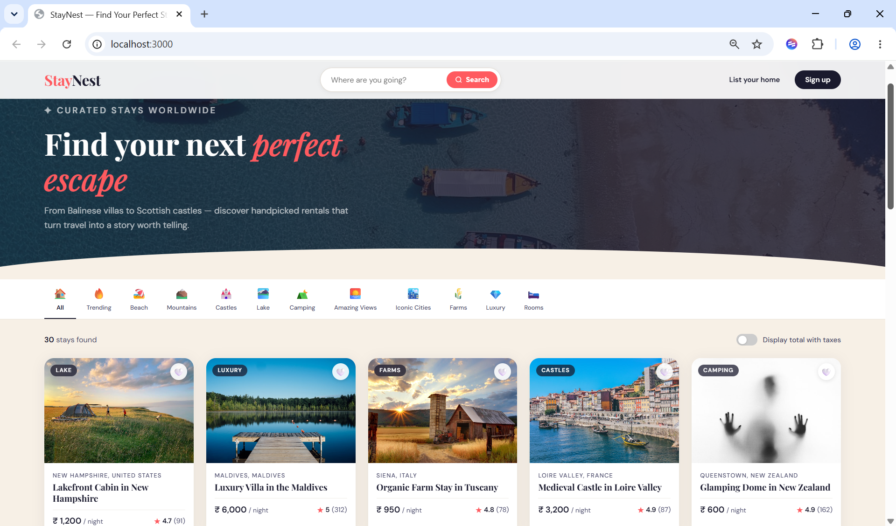
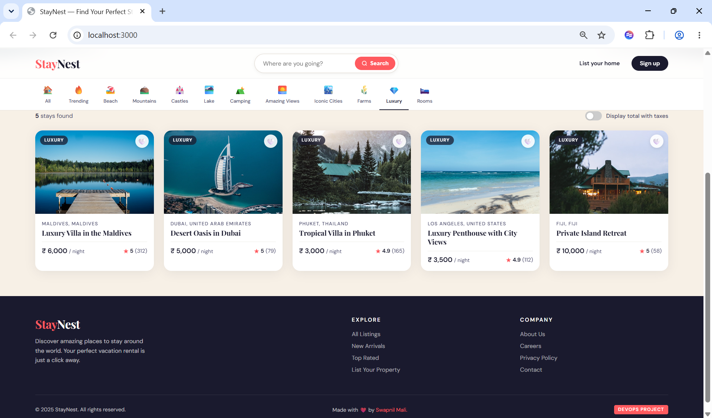

# 🏡 StayNest - Airbnb-like Full-Stack Rental Platform

> A production-grade vacation rental web app demonstrating containerized full-stack deployment with Docker, MongoDB, Express, and Nginx.


---

## 🏗️ Architecture

```diagram
┌──────────────────────────────────────────────────────────┐
│                    Docker Network (bridge)               │
│                                                          │
│  ┌─────────────┐     ┌─────────────┐    ┌────────────┐   │
│  │   Frontend  │────▶│   Backend   │───▶│  MongoDB  │   │
│  │  Nginx :80  │     │ Express:5000│    │  :27017    │   │
│  │  (Port 3000)│     │  (Port 5000)│    │            │   │
│  └─────────────┘     └─────────────┘    └────────────┘   │
│         ▲                                      ▲         │
│         │                              ┌────────────┐    │
│     Browser                            │ Seed Job   │    │
│                                        │ (one-shot) │    │
│                                        └────────────┘    │
└──────────────────────────────────────────────────────────┘
```

## 🚀 Tech Stack

| Layer | Technology |
| ------- | ----------- |  
| Frontend | HTML5, CSS3, Vanilla JS |
| Web Server | Nginx (reverse proxy + static serving) |
| Backend | Node.js 20, Express.js |
| Database | MongoDB 7.0 |
| Containerization | Docker, Docker Compose |
| Data | 30 seeded property listings |

## 📁 Project Structure

```tree-structure
staynest/
├── docker-compose.yml       # Orchestrates all services
├── mongo-init.js            # DB user & schema initialization
├── .gitignore
├── README.md
├── frontend/
│   ├── index.html           # SPA - listings page
│   ├── Dockerfile           # Nginx static server
│   └── nginx.conf           # Proxy + caching config
└── backend/
    ├── server.js            # Express app entry point
    ├── package.json
    ├── .env                 # MongoDB credentials
    ├── Dockerfile           # Multi-stage Node build
    ├── models/
    │   └── Listing.js       # Mongoose schema
    ├── routes/
    │   └── listings.js      # CRUD REST API
    └── seed/
        └── seed.js          # Seeds 30 property listings
```

## ⚡ Quick Start

### Prerequisites

- Docker Desktop installed
- Ports 3000, 5000, 27017 available

### Run the full stack

```bash
# Clone the repo
git clone https://github.com/devops-swapnil/staynest.git
cd staynest

# Build and start all containers
docker compose up --build

# The seed job runs automatically on first start
```

Open **http://localhost:3000** in your browser.

### Screenshots 

**1. Web Page**
    

**2. Search tab and footer**
    

### Tear down

```bash
docker compose down -v   # also removes volumes
```

## 🔌 API Endpoints

Base URL: `http://localhost:5000/api`

| Method | Endpoint | Description |
|--------|----------|-------------|
| GET | `/listings` | Get all listings |
| GET | `/listings?category=Beach` | Filter by category |
| GET | `/listings?search=Maldives` | Search by keyword |
| GET | `/listings/:id` | Get single listing |
| POST | `/listings` | Create listing |
| PUT | `/listings/:id` | Update listing |
| DELETE | `/listings/:id` | Delete listing |
| GET | `/health` | Health check |

## 🔐 MongoDB Credentials

| Field | Value |
|-------|-------|
| Root User | `root` |
| Root Password | `rootpassword` |
| App User | `staynest_user` |
| App Password | `staynest_pass` |
| Database | `staynest` |
| Auth Source | `staynest` |

## 🐳 Docker Details

- **Frontend**: `nginx:1.25-alpine` - serves static files, proxies `/api/*` to backend
- **Backend**: `node:20-alpine` (multi-stage build) - runs as non-root user for security
- **MongoDB**: `mongo:7.0` with persistent volume and health checks
- **Seed**: One-shot job that seeds 30 listings on first start
- All services communicate over an isolated Docker bridge network

## 📋 DevOps Highlights

- Multi-stage Docker builds (smaller images)
- Health checks on all services
- Dependency ordering with `condition: service_healthy`
- Non-root container user (security best practice)
- Nginx gzip compression & static asset caching
- Environment-based configuration via `.env`
- Persistent MongoDB volume

---

*Built as a DevOps project demonstrating containerization, microservices architecture, and full-stack development.*

---

## 📄 License

This project is open source and available under the [MIT License](LICENSE).

---

## ✍️ Author

<!-- Start author box -->
<table align="center" width="100%">
    <tr>
        <td align="left" valign="top" width="70%">
            <h2>SWAPNIL MALI.</h2>
            <p>
                <a href="https://github.com/devops-swapnil" target="_blank" align="center">
                   
                </a>
            </p>
            <p><em>👨🏻‍💻CS Engineer | AWS & DevOps Specialist -🎯focused on building reliable, observable, and scalable systems.</em></p>
        </td>
    </tr>
</table>
<!-- End author box -->

---
